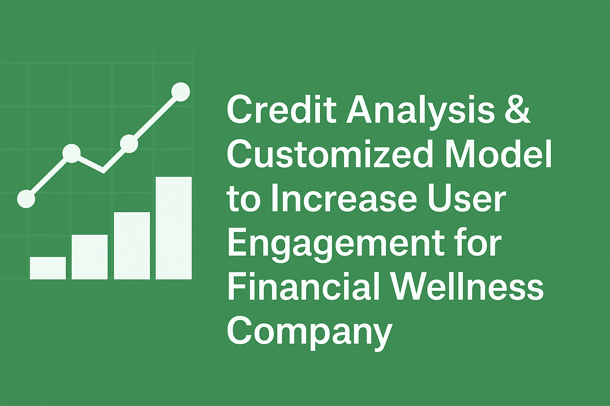

  

# 📦 Customized Credit Risk Model for a Real-World Fintech Client

---

🔒 Data Privacy Notice

This repository does not include or expose any raw data due to confidentiality agreements. All analysis is based on proprietary financial and behavioral datasets provided by the client.

---

## 👥 Author

Sam Hossain, As Part of MMA Team Gordon (Alisha Sahota, Anthony Ramelo, Chris Wu, Elizabeth Zhang, Emily Zhao)

---

## 🎯 Overview

This project showcases the development of a predictive credit analytics solution for a Canadian fintech lender. Using a combination of behavioral, psychographic, and credit bureau data, we developed models to assess financial wellness, default risk, and customer engagement dynamics.

---

## 📊 What’s Included

- 📓 Data Analysis & Modeling.ipynb
  The full notebook with:
  - Data wrangling (with synthetic columns for structure)
  - Missing value imputation (KNN & Iterative)
  - EDA, visualization, and hypothesis generation
  - Predictive modeling using logistic regression, random forest, and XGBoost
  - Business-driven interpretation of results

- 📄 Presentation.pdf

Executive summary deck highlighting model insights, business recommendations, and strategy implications.

---

## 🧪 Techniques Used

- Data Preprocessing: KNN & Iterative Imputation, categorical handling
- Feature Engineering: App-based behavior, credit utilization, engagement timelines
- Modeling: Logistic Regression, Random Forest, XGBoost
- Evaluation: ROC-AUC, precision-recall, confusion matrix
- Business Interpretation: Risk segmentation, engagement strategy, repayment prediction

---

## 🚀 Business Value

- Predictive scoring helps identify at-risk clients early
- Behavioral features allow tailored engagement interventions
- Enables credit strategy optimization without compromising privacy or compliance

---

## 🖼️ Visual Snapshots (below):
Note: These slides are for visual summary only. Full details are in the PDF.

